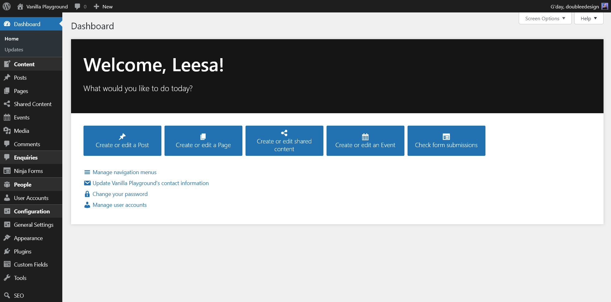
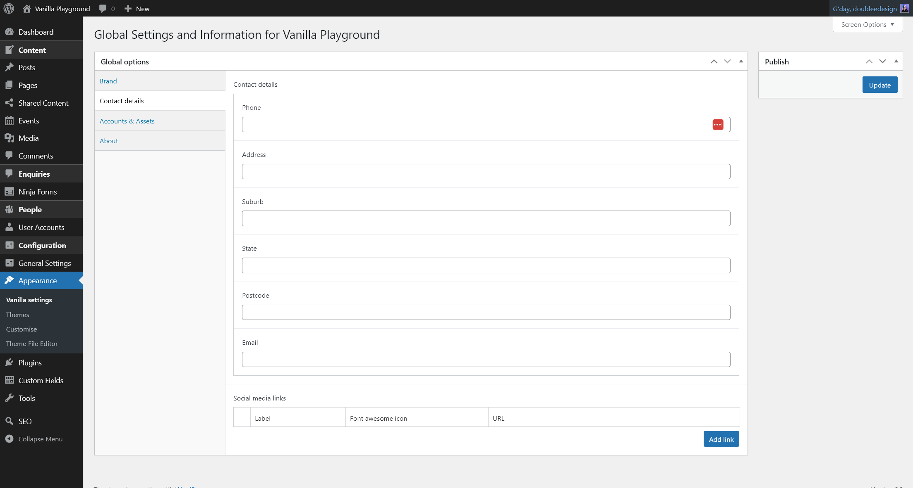

# doublee-base-plugin

Common customisations for client websites.

- [Features](#features)
  - [Customised welcome screen](#customised-welcome-screen)
  - [Global settings page](#global-settings-page)
  - ["Editor Plus" custom role](#editor-plus-custom-role)
  - [Other features](#other-features)
- [General intentions and advice](#general-intentions-and-advice)
- [Development](#development)
- [Changelog](#changelog)

## Features

### Customised welcome screen

The default WordPress welcome screen is replaced with a custom welcome screen that provides links to common actions relevant to the current site, using its post types, and the presence of particular plugins and options pages, and the current user's permissions to determine which actions to show.



The post types for which an "Add or edit" button is provided can be customised using the `doublee_welcome_screen_post_types` filter. For example, for clients who don't blog, you can remove the "Posts" button like so:

```php
add_filter('doublee_welcome_screen_post_types', function(array $post_types): array {
	unset($post_types['post']);
	return $post_types;
});
```

### Global settings page

An ACF Options page is included for site-wide, client-specific global settings such as logos and contact information. By default it is located under `Appearance → (Site name) Settings` in the admin menu. Where this information is used on the front-end is determined by the active theme and plugins.



If you are using ClassicPress, the logo field here automatically syncs with the ClassicPress logo setting in the General Settings page. It's kept in this options page as well because of the assumption that clients would expect to find it here.

The fields can be customised by plugins and themes using the `doublee_global_settings_fields` filter. If adding fields, please use the `doublee_global_settings_contributors` filter to ensure that the "About" tab content is accurate - this is helpful for troubleshooting.

### "Editor Plus" custom role

#### Permissions
- All the capabilities an Editor has
- Capabiltiies to add, edit, promote, and delete non-admin users
- All capabilities for Ninja Forms
- Capabilities to manage SmashBalloon Instagram and Facebook feed settings

#### How it works
- Upon plugin activation, the Editor Plus role is created based on the built-in Editor role, and some capabilities I commonly assign to clients are added to it
- Upon deactivation, users with the role are reverted to Editors
- Upon reactivation (without uninstallation), users who had the Editor Plus role should get it back (note: this is because a capability by the same name is left there unless the plugin is uninstalled; if you intend to use `current_user_can('editor_plus')` then this may not suit your needs)
- Upon uninstallation, the remnants of the role are totally wiped so if the plugin is reactivated again, custom roles must be manually reassigned.

### Other features
 - Customised admin menu ordering and sectioning
 - Admin notices for required/recommended plugins
 - Defaults for hiding and positioning of certain metaboxes in the admin edit screens (for simplicity)
 - Defaults for hiding and positioning of certain columns in the admin list tables (for simplicity)
 - Conditionally loading and saving certain ACF field groups within the plugin, rather than the active theme
 - An additional context for displaying metaboxes (`after_title`)
 - Automatic basic `<title>` tags (for sites that don't need a full SEO plugin)

Please see the [changelog](CHANGELOG.md) for more information and the latest updates.

---

## General intentions and advice

I use this with my own theme starterkits, and client-specific custom plugins, and other plugins I have developed to create custom sites with clear separation of concerns as much as is practical. As a  guide:
- Code related to front-end design and content display belongs in the theme
- Custom functionality, custom post types, custom taxonomies, modifications to WordPress functionality (including the admin UI), site-specific data structures and management belong in plugins.

---

## Development

More info to come.

---

## Changelog

Please see [CHANGELOG.md](CHANGELOG.md).
